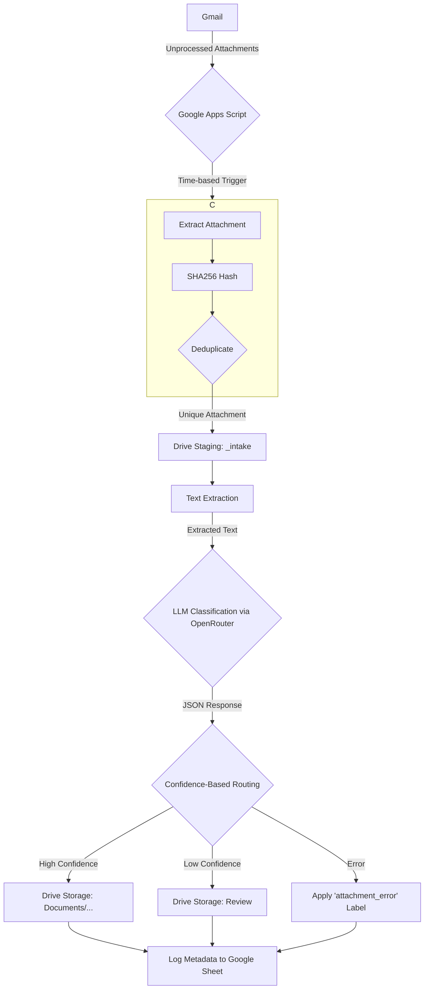

# Gmail Attachment Intelligence Pipeline

This Google Apps Script project automates the ingestion, classification, extraction, and routing of documents from Gmail attachments. It uses a Large Language Model (LLM) via OpenRouter to intelligently process and organize your files, turning your inbox into a structured document intake system.

## Features

- **Automated Document Ingestion:** Scans your Gmail for emails with attachments that haven't been processed.
- **Deduplication:** Uses SHA256 hashing to prevent processing the same attachment multiple times.
- **Text Extraction:** Extracts text from various file types, including PDFs, DOCX, and PPTX, using Google Drive's built-in OCR and conversion capabilities.
- **LLM-Powered Classification and Data Extraction:** Leverages the power of your chosen LLM via OpenRouter to classify documents (e.g., invoices, receipts, resumes) and extract relevant data.
- **Confidence-Based Routing:** Automatically routes documents to a structured folder system in your Google Drive based on the LLM's confidence in its classification.
- **Auditable Control Plane:** Logs all processing activities, including successes, failures, and extracted metadata, to a Google Sheet for easy monitoring and review.
- **Robust Error Handling:** Gracefully handles errors and applies a specific Gmail label to emails that could not be processed, ensuring no data is lost.

## High-Level Architecture

## Setup and Configuration

Follow these steps to get the Gmail Attachment Intelligence Pipeline up and running in your own Google account.

### Step 1: Create the Google Apps Script Project

1.  Go to the [Google Apps Script dashboard](https://script.google.com/home).
2.  Click **New project**.
3.  Give your project a name (e.g., "Gmail Attachment Intelligence Pipeline").
4.  Copy the code from `Code.gs`, `tests.gs`, and `appsscript.json` in this repository and paste it into the corresponding files in your Apps Script project. You may need to enable the manifest file view by going to **Project Settings** > **Show "appsscript.json" manifest file in editor**.

### Step 2: Enable Required Google Services

1.  In the Apps Script editor, click on **Services** in the left-hand menu.
2.  Add and enable the following Google services:
    *   **Google Drive API:** This is required for the PDF and Office document text extraction.
    *   **Google Sheets API:** This is required for logging metadata.
3.  Click **Editor** to return to the code.

### Step 3: Set Script Properties

1.  In the Apps Script editor, go to **Project Settings**.
2.  Under **Script Properties**, click **Add script property**.
3.  Add the following two properties:

    *   **`OPENROUTER_API_KEY`**: Your API key from [OpenRouter.ai](https://openrouter.ai/).
    *   **`SPREADSHEET_ID`**: The ID of the Google Sheet where you want to log the metadata. You can create a new Google Sheet and copy its ID from the URL (the long string of characters between `/d/` and `/edit`).

### Step 4: Initial Run and Permissions

1.  In the Apps Script editor, select the `processInbox` function from the dropdown menu at the top of the screen.
2.  Click **Run**.
3.  Google will prompt you to authorize the script. Follow the on-screen instructions to grant the necessary permissions. This will allow the script to access your Gmail, Drive, and Sheets.

### Step 5: Set Up Triggers

To run the script automatically, you need to set up a trigger:

1.  In the Apps Script editor, click on **Triggers** in the left-hand menu.
2.  Click **Add Trigger**.
3.  Configure the trigger as follows:
    *   **Function to run:** `processInbox`
    *   **Deployment:** `Head`
    *   **Event source:** `Time-driven`
    *   **Type of time based trigger:** `Minutes timer`
    *   **Select minute interval:** `Every 15 minutes` (or your preferred interval)
4.  Click **Save**.

## How to Use

Once the setup is complete, the pipeline will run automatically based on your trigger. To start processing attachments, simply leave emails with attachments in your inbox. The script will automatically:

1.  Find emails with unprocessed attachments.
2.  Extract, classify, and route the attachments.
3.  Apply one of the following labels to the email thread:
    *   `processed_attachments`: For successfully processed attachments.
    *   `attachment_review`: For attachments that were processed with low confidence and require your review.
    *   `attachment_error`: For attachments that could not be processed due to an error.

You can monitor the progress and results of the pipeline in the Google Sheet you specified in the script properties.
